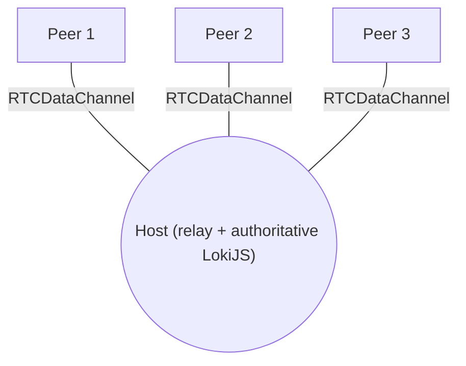

# Planning Poker

A serverless, peer-to-peer [planning poker](https://en.wikipedia.org/wiki/Planning_poker) app. Teams estimate work by voting with cards; everyone reveals at once. There is **no backend and no database** - peers connect directly to each other over **WebRTC** data channels, and session state is kept in-memory with [LokiJS](https://github.com/techfort/LokiJS) and synced peer-to-peer.

Built with plain ES modules and a small, light-hexagonal architecture. No framework, no build step.

## Features

- Peer-to-peer over WebRTC data channels (no signaling/app server you run)
- In-memory session state via LokiJS, synced to all peers
- Fibonacci deck: `0, 1, 2, 3, 5, 8, 13, 21, ?`
- Hidden votes until the host reveals; average and consensus on reveal
- Dark, framework-free UI
- Built-in connection diagnostics in the browser console

## Quick start (local)

WebRTC needs a secure context, so serve over `http://localhost` (not `file://`).

Using Docker:

```bash
docker compose up -d --build
# open http://localhost:8000
```

Or any static server, e.g. Python:

```bash
python3 -m http.server 8000
# open http://localhost:8000
```

Then, in two browser tabs/windows:

1. Tab A: enter a name, click **Host a session**.
2. Tab B: enter a name, click **Join a session** -> **Generate request code**, and send that code to the host.
3. Tab A: paste the request -> **Generate response code**, send it back.
4. Tab B: paste the response -> **Connect**. You're in.

See [docs/usage and deployment](docs/deployment.md) for hosting it publicly (GitHub Pages, etc.).

## How it works (in one paragraph)

Peers form a **star**: one **host** acts as the relay, and each joiner does a one-time manual copy-paste exchange of WebRTC connection codes (offer/answer) with the host. The host owns the authoritative session state in LokiJS; clients send actions (join, vote) to the host, which applies them and broadcasts a full state **snapshot** to everyone. Each peer mirrors that snapshot into its own LokiJS and re-renders. Full details and diagrams in [docs/webrtc.md](docs/webrtc.md).



## Project structure

```
index.html                  markup + view containers
styles.css                  dark theme
lib/loki.min.js             vendored LokiJS (global script)
js/
  main.js                   composition root + DOM event wiring
  domain/                   pure rules (deck, results, messages)
  application/              SessionController (use-cases, routing, state)
  adapters/
    store/                  LokiSessionStore (StateStore port)
    transport/              WebRTC: iceConfig, signaling, diagnostics, WebRtcTransport
  ui/                       elements registry + UiAdapter (rendering)
  infra/                    logger
Dockerfile, docker-compose.yml
docs/                       architecture, webrtc, deployment
```

## Documentation

- [docs/architecture.md](docs/architecture.md) - the hexagonal layering, ports, and module responsibilities
- [docs/webrtc.md](docs/webrtc.md) - how WebRTC is used: signaling, ICE/STUN/TURN, data channels, sync, troubleshooting
- [docs/deployment.md](docs/deployment.md) - running locally, Docker, and GitHub Pages

## Limitations

- **NAT traversal**: serverless WebRTC can't connect every network pair. Same easy/cone NATs connect via STUN; symmetric NAT / strict firewalls / corporate VPNs need a reachable **TURN** relay (see [docs/webrtc.md](docs/webrtc.md#nat-stun-and-turn)).
- **Host is the hub**: if the host's tab closes, the session ends (no persistence by design).
- **Manual signaling**: two copy-pastes per joiner - fine for a team, not for large groups.

## License

MIT (or your preference).
