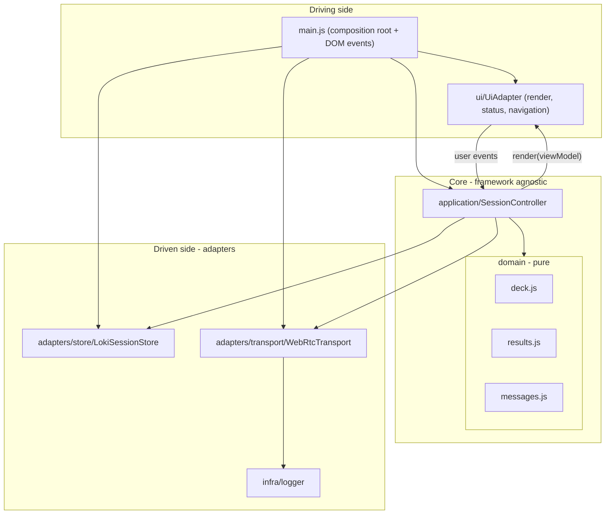

# Architecture

The app uses a **light hexagonal architecture** (ports and adapters). A framework-agnostic core (domain + application) is surrounded by adapters that talk to the outside world (DOM, WebRTC, LokiJS, console). Dependencies point inward: the core never imports a concrete adapter; the composition root wires them together.



## Layers

### Domain (`js/domain/`) - pure, no side effects
- [deck.js](../js/domain/deck.js) - the `DECK` constant and `isNumericVote(value)`.
- [results.js](../js/domain/results.js) - `computeResults(participants)` returns `{ average, consensus }`. Non-numeric votes (e.g. `?`) are ignored; consensus is the shared value when all numeric voters agree, otherwise `No`.
- [messages.js](../js/domain/messages.js) - the single source of truth for the wire protocol: `Actions` (action creators), `actionMsg`/`syncMsg` (envelopes), and `isAction`/`isSync` guards. Keeping these here means no message literals are duplicated across the codebase (DRY).

### Application (`js/application/`) - use-cases and orchestration
- [SessionController.js](../js/application/SessionController.js) holds session state (`selfId`, `name`, `role`, `myVote`, `lastRound`, `connected`) and exposes use-cases:
  - Host: `host(name)`, `createInvite()`, `applyResponse(code)`
  - Join: `join(name)`, `acceptInvite(code)`
  - Round: `castVote(value)`, `revealRound()`, `resetRound()`
  - Rendering: `buildViewModel()` -> `render()`
- It depends only on the injected ports (`store`, `transport`, `ui`) and the pure domain. It never touches the DOM, WebRTC, or LokiJS directly.

### Adapters (driven / secondary)
- [adapters/store/LokiSessionStore.js](../js/adapters/store/LokiSessionStore.js) - the **StateStore** port over LokiJS (a `participants` collection and a `session` document). Implements the action reducer and snapshot import/export.
- [adapters/transport/](../js/adapters/transport/) - the **Transport** port over WebRTC, split for single-responsibility:
  - `iceConfig.js` - STUN/TURN servers and the ICE-gathering timeout.
  - `signaling.js` - `encode`/`decode` connection codes and `waitForIce` (non-trickle ICE).
  - `diagnostics.js` - attaches lifecycle logging to a peer connection.
  - `frames.js` - the pure wire envelope helpers: `FrameKind`, `nextMid`/`nextNonce`, `serializeCandidate`, and the `appFrame`/`signalFrame`/`pingFrame` builders.
  - `SeenCache.js` - bounded dedup ring buffer (`markSeen`) that stops flood loops and duplicates.
  - `PeerLink.js` - one `RTCPeerConnection` + its data channel, with an async API for offer/answer negotiation, ICE candidate buffering, and channel wiring (trickle and non-trickle).
  - `LinkRegistry.js` - the set of direct links; idempotent `remove` so the two death signals collapse into one `onPeerClose`.
  - `MeshRouter.js` - flood/relay/consume and the app `broadcast`/`sendTo`.
  - `AutoDialer.js` - automatic in-band (trickle) link negotiation with the deterministic lower-id-offers rule.
  - `ManualSignaling.js` - the manual copy-paste first link. Invites are nonce-keyed in a `pendingOffers` Map, so the host can have several outstanding at once and match each response to its connection.
  - `Keepalive.js` - periodic pings to keep links and NAT bindings warm (never evicts).
  - `WebRtcTransport.js` - the thin composition root: `init({ selfId, handlers })` wires the modules above and returns the mesh API.
- [infra/logger.js](../js/infra/logger.js) - a tagged console logger; also exposes `window.PP.setDebug(...)`.

### UI (driving / primary)
- [ui/elements.js](../js/ui/elements.js) - the single DOM element registry.
- [ui/UiAdapter.js](../js/ui/UiAdapter.js) - the **UI** port: `render(viewModel)`, `setStatus(text, kind)`, `goTo(view)`, and `copy(textarea)`. It renders purely from a view-model and knows nothing about the store or transport.

### Composition root
- [main.js](../js/main.js) - the only module that knows concrete classes. It instantiates the adapters, injects them into `SessionController`, and wires DOM events (host/join, signaling, reveal/reset) to use-cases.

## Ports (contracts)

These are enforced by convention (plain objects/classes), not formal interfaces.

| Port | Methods | Implemented by |
| --- | --- | --- |
| StateStore | `getSession`, `listParticipants`, `applyAction`, `exportSnapshot`, `importSnapshot` | `LokiSessionStore` |
| Transport | `init({ selfId, handlers }) -> { createManualOffer, acceptManualOffer, acceptManualAnswer, ensureConnectedTo, broadcast, sendTo, peerIds }` | `WebRtcTransport` |
| UI | `render(vm)`, `setStatus`, `goTo`, `copy` | `UiAdapter` |

`handlers = { onMessage(appMsg, fromId), onPeerOpen(peerId), onPeerClose(peerId) }`.

## The view-model

`SessionController.buildViewModel()` returns:

```js
{ role, selfId, myVote, session, participants, results }
```

This decouples the UI from the store: `UiAdapter.render(vm)` is pure DOM with no store/domain imports beyond `DECK`.

## Why this shape

- **SRP**: each module has one reason to change (rendering, transport, persistence, rules...).
- **DIP**: the core depends on abstractions (ports), not on the DOM/WebRTC/LokiJS.
- **OCP**: new decks, actions, or a different transport are additive - swap an adapter without touching the core.
- **DRY**: message shapes, the logger, the DOM registry, and results math each live in exactly one place.
