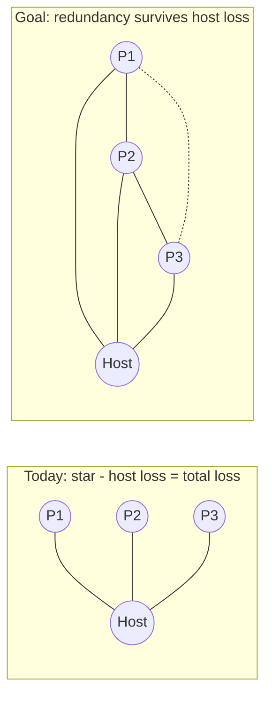

# Serverless reconnection - design analysis

Status: **Options A, C, and D implemented (Phases A, C, D).** Captures the discussion about keeping a room alive / simplifying reconnection when the host loses its connection, while staying serverless.

## Implementation status

- **A - full mesh + in-band signaling + deterministic election: DONE.** The transport now builds a full mesh ([WebRtcTransport.js](../js/adapters/transport/WebRtcTransport.js)) via a flooded in-band `signal` relay, and the coordinator is elected by seniority (earliest `joinedAt`, id tie-break) in [SessionController.js](../js/application/SessionController.js). Host loss is a silent role swap. Election is by seniority rather than the originally-sketched "lowest id" so the room creator stays host while present.
- **C - heartbeat + trickle ICE: DONE.** In-band links trickle ICE (offer/answer sent immediately, candidates streamed as `SignalTypes.candidate` and buffered until the remote description is set), so auto-links open in well under a second. A heartbeat (`HEARTBEAT_INTERVAL_MS` / `HEARTBEAT_TIMEOUT_MS` in [iceConfig.js](../js/adapters/transport/iceConfig.js)) pings neighbors and drops a silent link in ~9s, firing `onPeerClose` so the election runs even when `connectionState` never reaches `failed`. The manual first link still bundles ICE (no channel to trickle over yet).
- **D - shareable links + persistence: DONE (QR skipped).** The first link is shareable as a URL (host-initiated `#inv=`/`#res=` via [shareLinks.js](../js/ui/shareLinks.js)); inputs accept a link or a bare code. A stable per-tab `selfId` and session-level state (`round`/`revealed`) persist in **sessionStorage** ([persistence.js](../js/infra/persistence.js), wired into [LokiSessionStore.js](../js/adapters/store/LokiSessionStore.js)) so a refresh resumes instead of resetting. Participants are intentionally not persisted - the mesh re-syncs the live roster, so no ghost peers. QR was dropped because a bundled SDP is too large to scan reliably. sessionStorage (not localStorage) keeps ids unique per tab.

## Problem

The app uses a **star topology**: every peer connects only to the host, which is both the relay and the authoritative state owner ([js/adapters/transport/WebRtcTransport.js](../js/adapters/transport/WebRtcTransport.js), [js/application/SessionController.js](../js/application/SessionController.js)). If the host refreshes, crashes, or drops its network, **all** data channels close and the session collapses. With manual copy-paste signaling, recovering means redoing the handshake with everyone.

We want to simplify reconnection while keeping the serverless behavior (no signaling/app server we run).

## Core insight (defines the whole solution space)

> To re-link two peers after a connection drops, with no server, you need a path to exchange fresh signaling (SDP/ICE). That path can only be either:
> - (a) a connection that is still alive somewhere in the network, or
> - (b) a human action (copy-paste / QR / link).
>
> There is no third option without a server.

Therefore "simplify serverless reconnection" = **build redundancy proactively while peers are connected**, so there is always a surviving channel to re-signal through; fall back to manual only when the whole network is gone.

## The core building block: in-band signaling

Manual copy-paste is only needed for a peer's **first** connection. Once a peer has any open data channel, offer/answer/ICE can be relayed as JSON **over that channel** - no copy-paste. The host (which everyone is connected to) is the natural relay to bootstrap new links.

- Add a `signal` message kind to [js/domain/messages.js](../js/domain/messages.js).
- The host already relays messages in [js/application/SessionController.js](../js/application/SessionController.js).

With in-band signaling, all options below cost zero extra copy-paste.

## Options (increasing resilience)

### A. Promote the star to a mesh, then auto-elect a host (IMPLEMENTED)
- On join (one manual exchange with any existing member), peers gossip a roster and relay signaling in-band so the new peer connects directly to every existing peer -> full mesh.
- Everyone already mirrors full state (snapshot broadcast) and knows the roster.
- Coordinator = a deterministic function of the roster. As built, that is the most senior connected participant (earliest `joinedAt`, id tie-break) so the creator keeps the role while present; if the coordinator drops, each peer independently recomputes the same new winner - no negotiation, no reconnection, because mesh links already exist. The new coordinator simply starts acting as authority.
- Result: host loss becomes a role change, not a reconnect. Cost: `O(n^2)` connections - fine for a planning-poker team (<= ~12).

### B. Partial mesh with a "backup host" (lighter)
- Each peer keeps one extra link to a designated vice-host (e.g. the second peer to join), set up via in-band signaling.
- If the host dies, the vice-host promotes; peers are already linked to it (or re-link quickly using cached info relayed earlier). Fewer connections than full mesh, a bit more logic to keep the backup fresh.

### C. Failover + fast re-signaling (IMPLEMENTED)
- Detect host loss via existing `connectionState` plus a heartbeat (so silent drops are noticed within ~9s). DONE.
- In-band links use trickle ICE over the data channel (candidates sent as they arrive) instead of the non-trickle "wait for gathering" used for the manual code - links form fast and automatically. DONE.
- Bounded auto-retry with backoff was not needed: a dropped peer is simply re-dialed through the existing roster / `ensureConnectedTo` path.

### D. Graceful manual fallback (when redundancy is exhausted) (IMPLEMENTED)
- If every channel is gone (everyone refreshed, or the first connection never had a backup), human signaling is unavoidable. Made painless:
  - Offer/answer are wrapped in a URL (`#inv=`/`#res=`); an invite link opens straight into the join flow. QR was skipped (bundled SDP too large to scan). DONE.
  - A stable per-tab `selfId` and session-level state (round/revealed) persist in sessionStorage, so a refresh resumes the same round. Participants are not persisted (the mesh re-syncs them). DONE.

## Trade-offs

| Approach | Reconnect UX after host loss | Extra connections | Complexity |
| --- | --- | --- | --- |
| Today (star) | Re-paste with everyone | none | none |
| A. Mesh + election | Automatic, zero clicks | O(n^2) | medium |
| B. Backup host | Automatic (to vice-host) | +1 per peer | medium |
| C. Failover + trickle | Automatic if a path survives | depends | low-medium |
| D. URL/QR fallback | One link/scan | none | low |

## Recommendation

For a small team and the "simple + serverless" goals, **A (full mesh via in-band signaling + deterministic host election)** is the sweet spot: the first join stays a single manual exchange, everything after is automatic, and host loss degrades to a silent role swap. Layer in **C** (heartbeat + trickle ICE) for speed, and keep **D** (URL/QR + LokiJS persistence) as the last-resort fallback.

## Honest limit

If all peers lose their connections simultaneously (everyone closes the tab), no serverless trick can auto-reconnect them - that case unavoidably needs a human to share one link/code again.

## Related

- Data survival across a host refresh (LokiJS persistence + persisted `selfId`) is a separate, smaller change; see the discussion in chat. It restores state but not connections, so it complements - not replaces - the redundancy options above.
