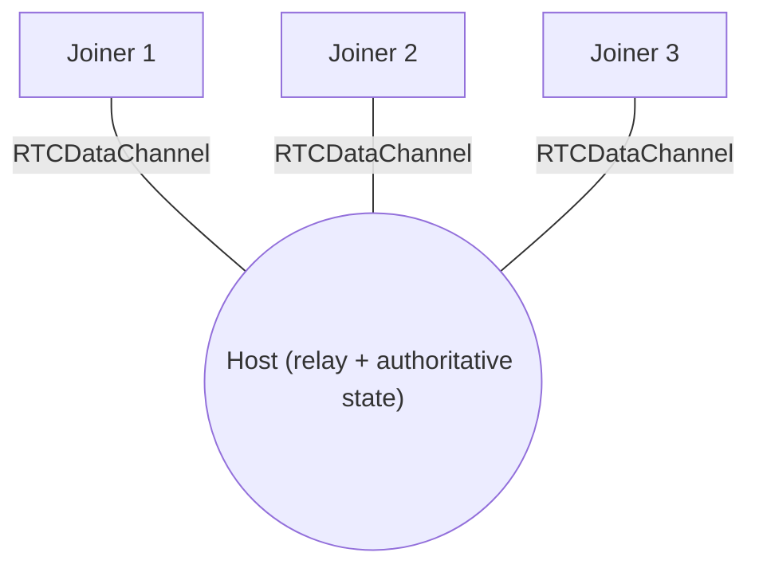
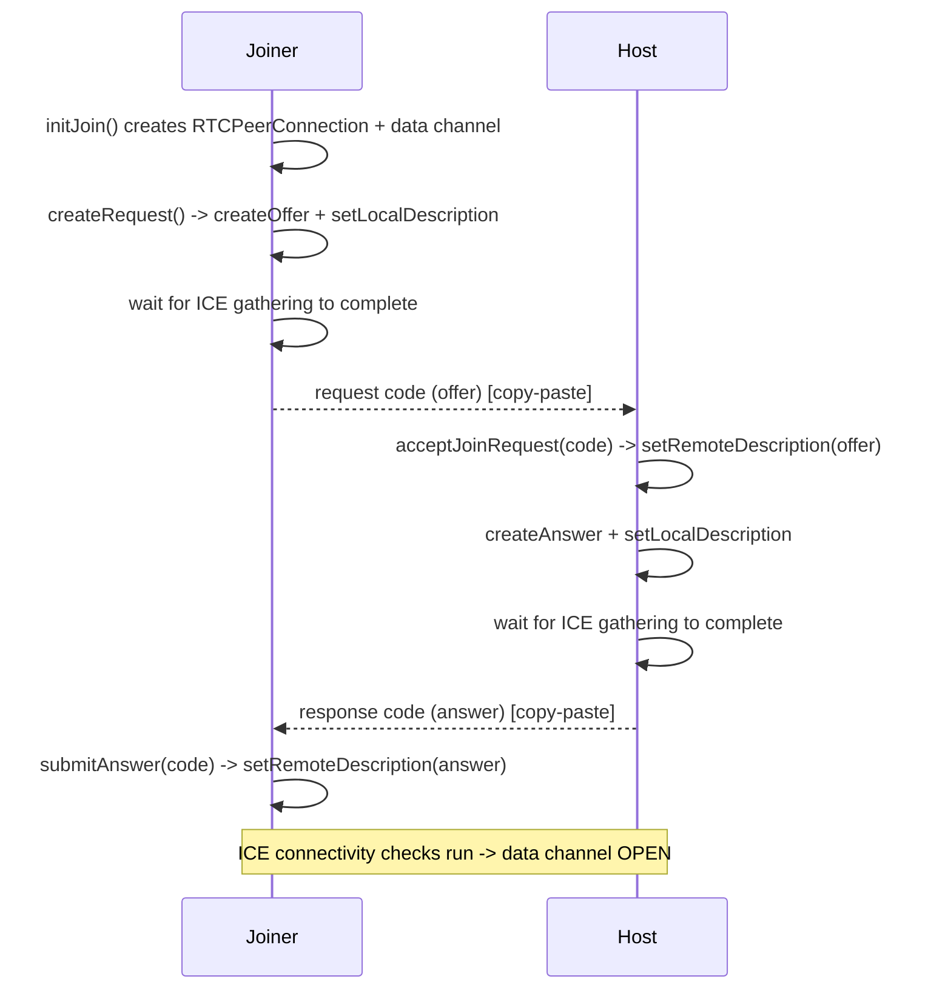
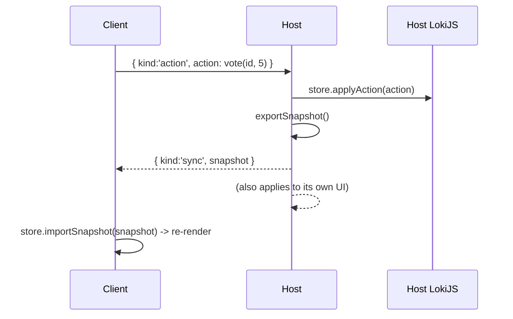

# WebRTC in this project

This document explains how the app uses WebRTC to connect peers without a server, how the manual signaling works, how state is synced, and how to debug connection problems.

All transport code lives in [js/adapters/transport/](../js/adapters/transport/).

## Why WebRTC, and the signaling problem

WebRTC lets two browsers open a direct, encrypted **data channel** (`RTCDataChannel`) to each other - no server in the data path. But before that channel can open, the two peers must exchange two things:

1. **Session descriptions (SDP)** - an `offer` from one side and an `answer` from the other (codecs, parameters, the data-channel setup).
2. **ICE candidates** - the network addresses each peer can be reached at.

The mechanism for trading these is called **signaling**, and WebRTC deliberately does not define it. Normally you'd run a small signaling server (WebSocket, etc.). To stay fully serverless, this app uses **manual copy-paste signaling**: the offer/answer blobs are shown as text codes that users send to each other (Slack, chat, etc.).

## Topology: a star with the host as relay

Manual signaling does not scale to a full mesh (a mesh of `n` peers needs `n x (n-1) / 2` copy-paste exchanges). Instead, peers form a **star**:

- One person is the **host** (the hub).
- Every other peer (**joiner**) does exactly one offer/answer exchange with the host.
- The host **relays** application messages between everyone and owns the authoritative state.



This keeps manual signaling at one exchange (two codes) per joiner, regardless of how many people join.

## The signaling handshake (joiner-initiated)

The joiner creates the offer; the host answers. A "code" is just the local description, JSON-stringified and base64-encoded - see `encode`/`decode` in [signaling.js](../js/adapters/transport/signaling.js).



### Non-trickle ICE (why we wait)

ICE candidates are normally discovered over time ("trickle"). Since we can only paste **one** code, we wait until ICE gathering is fully complete before producing the code, so every candidate is already embedded in the SDP. That is what `waitForIce(pc)` does in [signaling.js](../js/adapters/transport/signaling.js): it resolves when `iceGatheringState === 'complete'`, or after a safety timeout (`ICE_WAIT_MS`, 6s) so a slow/unreachable TURN server can't block code generation forever.

### Idempotent answer handling

`acceptAnswer` in [WebRtcTransport.js](../js/adapters/transport/WebRtcTransport.js) only applies the answer when the connection is in `have-local-offer`. If it's already `stable` (e.g. the user clicked Connect twice), it no-ops instead of throwing `InvalidStateError: ... Called in wrong state: stable`. It also rejects a pasted code whose `type` is not `answer`.

## NAT, STUN, and TURN

For peers on different networks, each one's real address is hidden behind NAT. ICE uses helper servers to get around this; configured in [iceConfig.js](../js/adapters/transport/iceConfig.js):

- **STUN** tells a peer its own public IP:port (a `srflx` candidate). Enough for typical home/office (cone) NATs. We use Google's public STUN.
- **TURN** is a relay that forwards the data when a direct path is impossible (symmetric NAT, strict firewalls, corporate VPNs). It is the fallback that makes "hard" networks work. The config includes the free public Open Relay project.

Candidate types you'll see in the logs:

| Type | Meaning |
| --- | --- |
| `host` | a local interface address (often an mDNS `.local` name for privacy) |
| `srflx` | server-reflexive: your public address as seen by STUN |
| `relay` | allocated on a TURN server (data is relayed) |

If gathering ends with `srflx: 0` and `relay: 0`, only local candidates exist and cross-network peers will fail.

## Application protocol over the data channel

Once a channel is open, peers exchange small JSON messages. The shapes are defined once in [messages.js](../js/domain/messages.js):

- Client -> host: `{ kind: 'action', action: { type, ... } }`
- Host -> all: `{ kind: 'sync', snapshot: { session, participants } }`

Action types: `join`, `vote`, `leave`, `reveal`, `reset`.

### Sync model (host is authoritative)



- The **host** applies every action to its LokiJS store and broadcasts a full snapshot to all channels (`_syncAll()` in [SessionController.js](../js/application/SessionController.js)).
- **Clients** never mutate authoritative state; they send actions and render whatever snapshot the host sends back.
- The host's own actions (its vote, reveal, reset) are applied locally and then broadcast.
- When a client's channel closes, the host removes that participant (`leave`) and re-syncs.

Votes stay hidden until reveal because the UI only shows a "voted" checkmark (not the value) while `session.revealed` is false; on reveal it shows values plus the computed average/consensus.

## Diagnostics and logging

Every peer connection is instrumented by `diagnose(pc, label)` in [diagnostics.js](../js/adapters/transport/diagnostics.js), which logs (via [infra/logger.js](../js/infra/logger.js)):

- `signalingState`, `iceGatheringState`, `iceConnectionState`, `connectionState` transitions
- each local ICE candidate and its type, plus a `candidates gathered { host, srflx, relay, ... }` summary
- ICE candidate errors, data-channel open/close/error, and every message sent/received

Open DevTools (works in incognito too) to follow a connection. Tags: `JOIN->host`, `HOST<-peer#N`, and `APP`. Toggle logging at runtime:

```js
PP.setDebug(false)
```

## Troubleshooting

Read the `iceConnectionState` transitions and the `candidates gathered` summary first.

- **`checking -> connected` then `data channel OPEN`**: success.
- **`checking -> disconnected/failed`**: no working candidate pair. Causes seen in practice:
  - Only `host` candidates that are mDNS `.local` names, which can't be resolved (e.g. when opened from `file://`, or across a VPN that blocks multicast). Fix: serve over `http://localhost` (or HTTPS), and for same-machine testing you can disable Chrome's mDNS at `chrome://flags/#enable-webrtc-hide-local-ips-with-mdns` so it emits the real LAN IP.
  - Two different public IPs in your `srflx` candidates -> **symmetric NAT / CGNAT / VPN**. Direct P2P is impossible; you need TURN.
  - TURN attempts time out (`TURN allocate request timed out` / `Failed to establish connection`) -> the network blocks the relay. Use a TURN host the network permits, or test off the VPN.
- **`InvalidStateError ... wrong state: stable` when connecting**: the answer was applied twice; handled by the idempotent `acceptAnswer`, and the UI disables Connect after the first click.

### Getting a reliable TURN

The bundled free Open Relay endpoint may be blocked on some networks. For dependable cross-network use, create free TURN credentials (e.g. at [metered.ca](https://metered.ca)) and replace the `turn:` entries' `username`/`credential` in [iceConfig.js](../js/adapters/transport/iceConfig.js).
