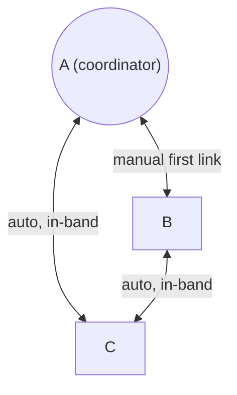
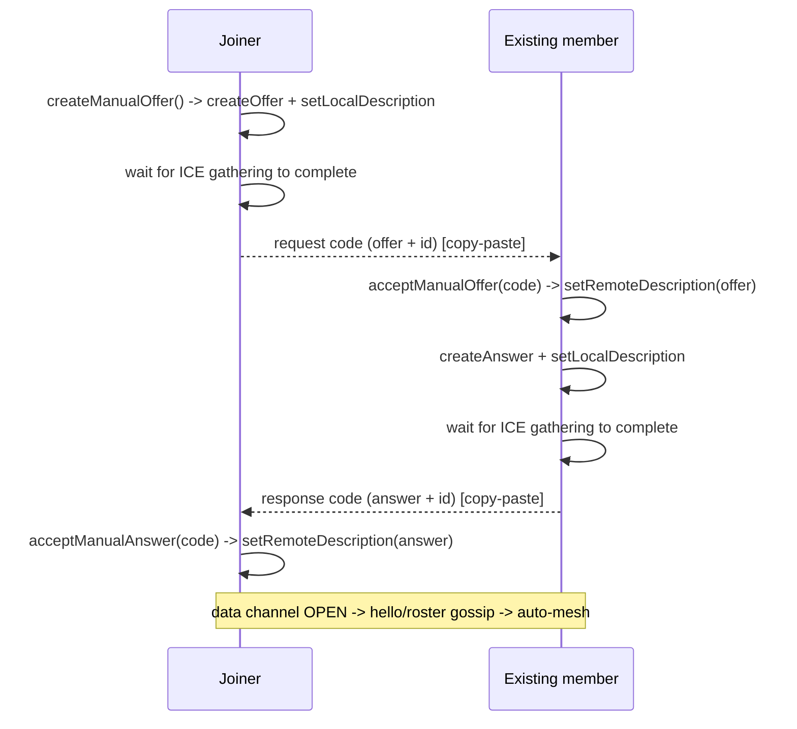
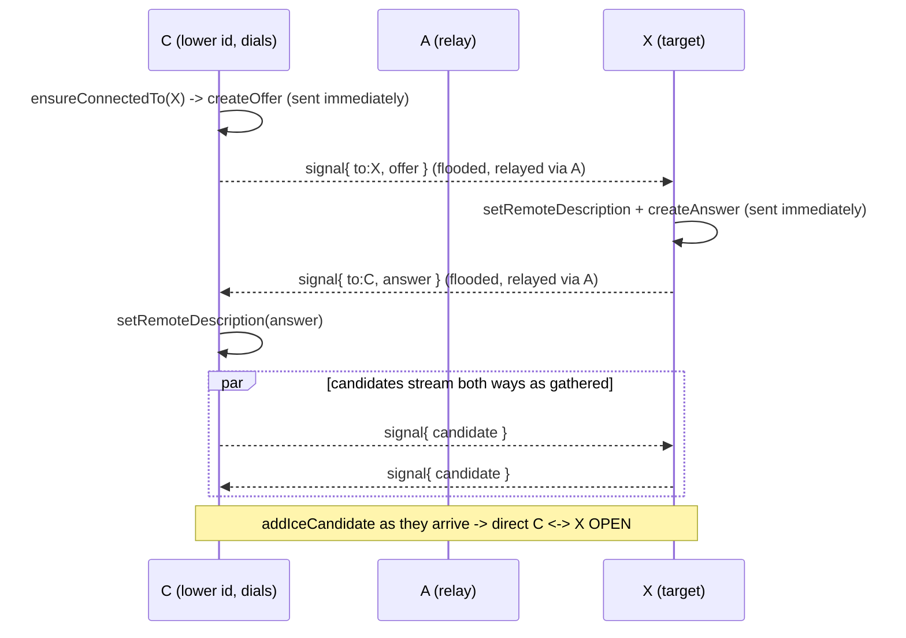
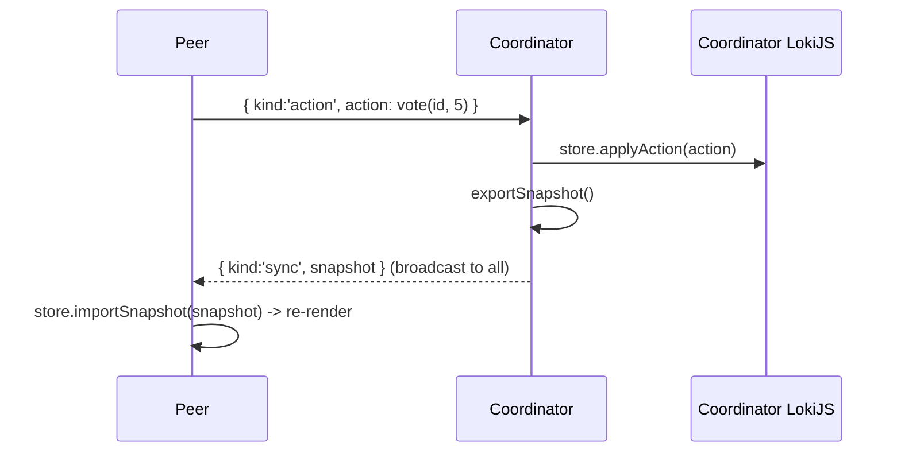

# WebRTC in this project

This document explains how the app uses WebRTC to connect peers without a server, how the manual signaling works, how state is synced, and how to debug connection problems.

All transport code lives in [js/adapters/transport/](../js/adapters/transport/).

## Why WebRTC, and the signaling problem

WebRTC lets two browsers open a direct, encrypted **data channel** (`RTCDataChannel`) to each other - no server in the data path. But before that channel can open, the two peers must exchange two things:

1. **Session descriptions (SDP)** - an `offer` from one side and an `answer` from the other (codecs, parameters, the data-channel setup).
2. **ICE candidates** - the network addresses each peer can be reached at.

The mechanism for trading these is called **signaling**, and WebRTC deliberately does not define it. Normally you'd run a small signaling server (WebSocket, etc.). To stay fully serverless, this app uses **manual copy-paste signaling**: the offer/answer blobs are shown as text codes that users send to each other (Slack, chat, etc.).

## Topology: a self-healing full mesh

Earlier versions used a **star** (everyone connected to one host). That kept manual signaling cheap but made the host a single point of failure: if it dropped, the session fell apart. As of Phase A the app forms a **full mesh** - every peer holds a direct data channel to every other peer - while keeping manual signaling to a single exchange.

The trick is to only ever do **one** manual copy-paste (the first link into the session). Every link after that is negotiated automatically with **in-band signaling**: the SDP offers/answers travel as ordinary messages over the data channels that already exist.



- The **first** person to reach the session does one manual offer/answer exchange with an existing member (exactly the old host/join copy-paste).
- Once that link is open, peers **gossip** a roster (`hello` / `roster` messages) so everyone learns everyone else's id.
- Each peer then auto-dials the peers it isn't connected to yet, until the mesh is complete.

### Deterministic coordinator (host election)

State still needs a single authoritative writer to avoid conflicts, but that role is now **computed**, not fixed:

- The **coordinator** is the most senior connected participant - earliest `joinedAt`, ties broken by id. Because `joinedAt` rides along in the shared snapshot, every peer independently computes the same winner.
- Only the coordinator applies actions and broadcasts snapshots. Everyone else mirrors snapshots and routes their own actions to the coordinator.
- When the coordinator drops, the next-most-senior peer is already the new winner of the same calculation, and it already holds the latest snapshot it was mirroring. So host loss is a **silent role swap**, not a reconnection scramble. See `coordinatorId()` / `amCoordinator()` in [SessionController.js](../js/application/SessionController.js).

### Avoiding offer glare

When two peers try to connect to each other, both creating offers at once causes "glare". The mesh avoids it with a deterministic dialer rule in `ensureConnectedTo` ([WebRtcTransport.js](../js/adapters/transport/WebRtcTransport.js)): for any pair, **the peer with the lower id offers; the higher id waits** and answers. No rollback or perfect-negotiation needed.

## The first handshake (manual, joiner-initiated)

The joiner creates the offer; the existing member answers. A "code" is `{ id, desc }` (the peer's id plus its local description), JSON-stringified and base64-encoded - see `encode`/`decode` in [signaling.js](../js/adapters/transport/signaling.js). Embedding the id lets each side learn who it just connected to.



## In-band signaling (every link after the first)

New links never need copy-paste. The dialer floods a `signal` frame addressed to its target; intermediate peers relay it until it arrives, then the answer comes back the same way. In-band links use **trickle ICE**: the offer/answer is sent immediately and candidates stream as they are discovered (no `waitForIce`), so links open in well under a second instead of waiting out the gathering timeout.



### Frame envelope and the flood relay

Every byte on a channel is one envelope: `{ mid, from, to, kind, body }`.

- `mid` is a unique id; each peer keeps a bounded set of seen `mid`s and drops duplicates, which stops flood loops.
- `to` is a target id, or `null` for a broadcast.
- `kind` is `signal` (consumed inside the transport), `app` (handed to the controller), or `ping` (heartbeat, see below).

A peer that receives a frame not addressed to it simply re-floods it to its other open channels. With a connected graph this reliably reaches a peer you have no direct link to yet - which is exactly how a brand-new joiner negotiates links to members it has never spoken to. Once the direct channel is up, traffic between them is a single hop.

### Trickle vs bundled ICE

ICE candidates are normally discovered over time ("trickle"). The two link types handle them differently:

- **In-band (auto) links trickle.** `ensureConnectedTo` and the in-band `onSignal` handler send the offer/answer right after `setLocalDescription` and then stream each candidate as a `signal` of type `candidate` (`SignalTypes.candidate`). The receiver calls `addIceCandidate` as they arrive. Because flooded frames can arrive out of order, candidates that show up before the remote description is set are buffered per peer (`candBuf`) and flushed once `setRemoteDescription` resolves.
- **The manual first link bundles.** There is no channel yet to trickle over, so it still waits for full gathering with `waitForIce(pc)` in [signaling.js](../js/adapters/transport/signaling.js) (resolves on `iceGatheringState === 'complete'` or after `ICE_WAIT_MS`, 6s) and embeds every candidate in the one pasted code.

### Heartbeat / liveness

`connectionState` can take 15s+ to flip to `failed`, and on some silent drops (laptop sleep, yanked network) it never does. So the transport also runs a heartbeat: every `HEARTBEAT_INTERVAL_MS` (3s) it sends a `ping` frame to each open neighbor and records `lastSeen` on any inbound traffic. A link that has opened but received nothing for `HEARTBEAT_TIMEOUT_MS` (9s, ~3 missed pings) is torn down with `removeLink`, which fires `onPeerClose` and lets the controller re-elect a coordinator promptly. Links that have not opened yet are exempt, so a manual link can sit pending while a human relays the answer code. Timing constants live in [iceConfig.js](../js/adapters/transport/iceConfig.js).

### Idempotent answer handling

`acceptManualAnswer` in [WebRtcTransport.js](../js/adapters/transport/WebRtcTransport.js) only applies the answer when the connection is in `have-local-offer`. If it's already `stable` (e.g. the user clicked Connect twice), it no-ops instead of throwing `InvalidStateError: ... Called in wrong state: stable`. It also rejects a pasted code whose description `type` is not `answer`. The in-band `onSignal` handler applies the same guard before consuming an `answer`.

## NAT, STUN, and TURN

For peers on different networks, each one's real address is hidden behind NAT. ICE uses helper servers to get around this; configured in [iceConfig.js](../js/adapters/transport/iceConfig.js):

- **STUN** tells a peer its own public IP:port (a `srflx` candidate). Enough for typical home/office (cone) NATs. We use Google's public STUN.
- **TURN** is a relay that forwards the data when a direct path is impossible (symmetric NAT, strict firewalls, corporate VPNs). It is the fallback that makes "hard" networks work. The config includes the free public Open Relay project.

Candidate types you'll see in the logs:

| Type | Meaning |
| --- | --- |
| `host` | a local interface address (often an mDNS `.local` name for privacy) |
| `srflx` | server-reflexive: your public address as seen by STUN |
| `relay` | allocated on a TURN server (data is relayed) |

If gathering ends with `srflx: 0` and `relay: 0`, only local candidates exist and cross-network peers will fail.

## Application protocol over the data channel

Once a channel is open, peers exchange small JSON messages (the `body` of an `app` frame). The shapes are defined once in [messages.js](../js/domain/messages.js):

- peer -> coordinator: `{ kind: 'action', action: { type, ... } }` (routed with `sendTo`)
- coordinator -> all: `{ kind: 'sync', snapshot: { session, participants } }` (broadcast)
- any -> all: `{ kind: 'hello', id, name }` and `{ kind: 'roster', roster: [{id,name}] }`

Action types: `join`, `vote`, `leave`, `reveal`, `reset`. A peer announces itself with `hello`; the coordinator turns that into a `join` and re-syncs, so a newcomer never sends its own `join` action.

### Sync model (the coordinator is authoritative)



- The **coordinator** applies every action to its LokiJS store and broadcasts a full snapshot to all channels (`_syncAll()` in [SessionController.js](../js/application/SessionController.js)).
- Non-coordinators never mutate authoritative state; they send actions to the coordinator and render whatever snapshot comes back. A fresh joiner is not eligible to be coordinator until it has received its first snapshot (`synced`), which prevents two writers during bootstrap.
- The coordinator's own actions (its vote, reveal, reset) are applied locally and then broadcast.
- When a peer's link closes, the most senior survivor removes that participant (`leave`) and re-syncs - and if the peer that left was the coordinator, that survivor is the new coordinator.

Votes stay hidden until reveal because the UI only shows a "voted" checkmark (not the value) while `session.revealed` is false; on reveal it shows values plus the computed average/consensus.

## Diagnostics and logging

Every peer connection is instrumented by `diagnose(pc, label)` in [diagnostics.js](../js/adapters/transport/diagnostics.js), which logs (via [infra/logger.js](../js/infra/logger.js)):

- `signalingState`, `iceGatheringState`, `iceConnectionState`, `connectionState` transitions
- each local ICE candidate and its type, plus a `candidates gathered { host, srflx, relay, ... }` summary
- ICE candidate errors, data-channel open/close/error, and every message sent/received

Open DevTools (works in incognito too) to follow a connection. Tags: `MANUAL(offer)` / `MANUAL<->id` for the first link, `MESH->id` (we dialed) / `MESH<-id` (we answered) for auto links, and `APP` for application events. Toggle logging at runtime:

```js
PP.setDebug(false)
```

## Troubleshooting

Read the `iceConnectionState` transitions and the `candidates gathered` summary first.

- **`checking -> connected` then `data channel OPEN`**: success.
- **`checking -> disconnected/failed`**: no working candidate pair. Causes seen in practice:
  - Only `host` candidates that are mDNS `.local` names, which can't be resolved (e.g. when opened from `file://`, or across a VPN that blocks multicast). Fix: serve over `http://localhost` (or HTTPS), and for same-machine testing you can disable Chrome's mDNS at `chrome://flags/#enable-webrtc-hide-local-ips-with-mdns` so it emits the real LAN IP.
  - Two different public IPs in your `srflx` candidates -> **symmetric NAT / CGNAT / VPN**. Direct P2P is impossible; you need TURN.
  - TURN attempts time out (`TURN allocate request timed out` / `Failed to establish connection`) -> the network blocks the relay. Use a TURN host the network permits, or test off the VPN.
- **`InvalidStateError ... wrong state: stable` when connecting**: the answer was applied twice; handled by the idempotent `acceptManualAnswer`, and the UI disables Connect after the first click.
- **A new joiner connects to one member but others don't appear**: the in-band signal flood needs a connected graph. Check the logs for `MESH->`/`MESH<-` tags and `signal` frames being relayed; if auto-dials never start, the `hello`/`roster` gossip isn't reaching peers (open DevTools on the member that accepted the manual link).

### Getting a reliable TURN

The bundled free Open Relay endpoint may be blocked on some networks. For dependable cross-network use, create free TURN credentials (e.g. at [metered.ca](https://metered.ca)) and replace the `turn:` entries' `username`/`credential` in [iceConfig.js](../js/adapters/transport/iceConfig.js).
